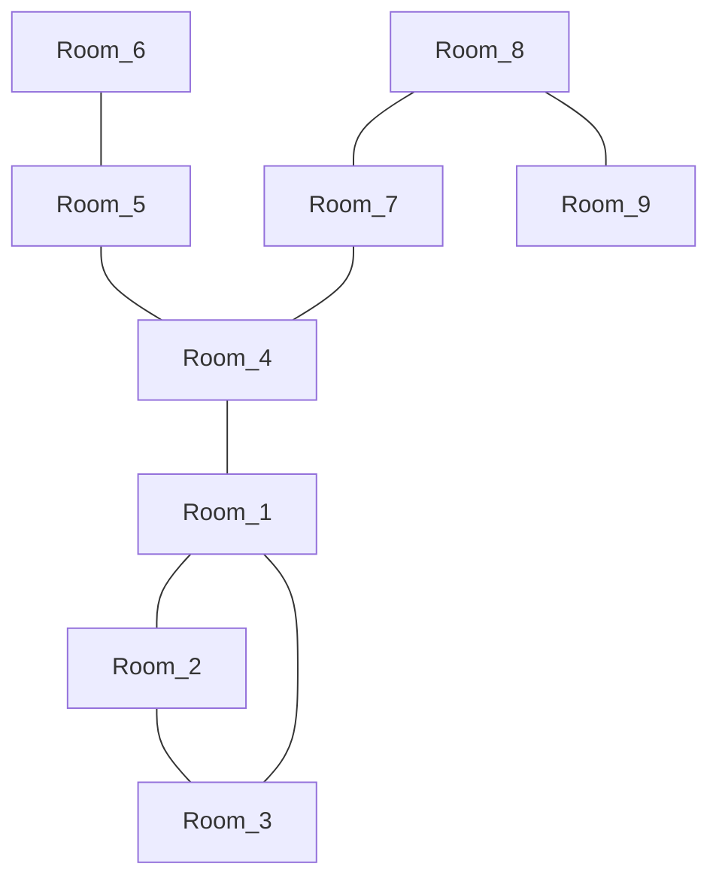

# Bunker (RPG Update)

**`Бункер`** - это настольная дискуссионная игра для 8–16 игроков.

**`RPG Update`** - обновлённая версия игры «Бункер», в которой геймплей больше напоминает кооперативную RPG-игру.

## Глоссарий

**`Лор`** - предыстория попадания персонажей в `Бункер`.

**`Бункер`** - комплекс соединённых между собой `комнат`, по которым игроки могут передвигаться в течение игры. Пример для понимания:

---



---

## Глоссарий

**`Персонаж`** — игровая единица, представленная `досье` и `багажом`, ассоциированная с конкретным игроком.

**`Комната`** — локация, в которую может перейти персонаж. Может содержать `предметы` или `события`.

**`Досье`** — набор уникальных характеристик, определяющих личность и способности персонажа.  
Пример досье:
```
{
    "Профессия" : "Санитар",
    "Биология"  : "Женщина, 32 года",
    "Факт"      : "Чемпион мира по скоростному поеданию гамбургеров",
    "Здоровье"  : "Рак мозга",
    "Хобби"     : "Рыбалка"
}
```

**`Черта`** — характеристика персонажа, представленная в формате `"ключ" : "значение"`.

**`Багаж`** — перечень предметов, принадлежащих персонажу.

**`Предмет`** — объект, которым может владеть персонаж. Имеет название, описание и эффект, влияющий на игровой процесс.

**`Событие`** — любое происшествие, способное изменить параметры игры или повлиять на её ход.

---

## Ход игры

| Этап                 | Описание |
|---|---|
| **Подготовка**        | Раздача `досье` и `багажа`. Озвучивание начального `лора`. |
| **Раскрытие комнаты** | Раскрывается описание текущей `комнаты`, выдаются находящиеся в ней `предметы`. |
| **Раскрытие черт**    | Каждый игрок по очереди раскрывает одну характеристику из своего `досье`. |
| **Обсуждение**        | Игроки обсуждают, кого стоит изгнать в текущем цикле. |
| **Голосование**       | Игроки голосуют за изгнание одного из персонажей. Изгнанный раскрывает своё `досье` и `багаж`. |
| **Перемещение**       | Голосование за следующую `комнату`, в которую переместятся игроки. |

---

🔁 Цикл продолжается с этапа **"Раскрытие комнаты"**.

> [!IMPORTANT]
> Игра продолжается до тех пор, пока не останется **половина** от изначального числа персонажей.
